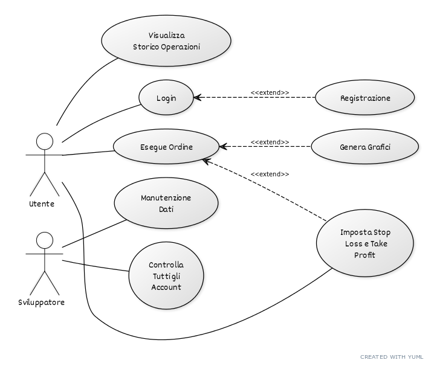
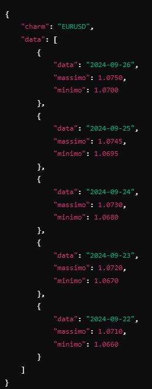

# TrForex

Impara a gestire la FOMO da trader a costo zero

## Descrizione

Con l'app **TrForex**, i giovani investitori che desiderano entrare nel mondo azionario possono creare un conto demo per aprire posizioni in Forex e comprare azioni, senza rischiare il proprio capitale. TrForex è progettata per aiutarti a sviluppare le tue competenze di trading e a gestire la paura di perdere opportunità (FOMO).

## Caratteristiche

- **Conto Demo**: Inizia a fare trading senza rischiare il tuo denaro.
- **Forex e Azioni**: Sperimenta diverse strategie di investimento in un ambiente sicuro.
- **Formazione**: Risorse educative per migliorare le tue conoscenze sul trading.
- **Gestione della FOMO**: Strumenti e consigli per aiutarti a prendere decisioni più consapevoli.

## Competitor 

I principali competitor che offrono funzionalità identiche al mio progetto sono MetaTrader 4, MetaTrader 5, XMtrade, FXTM, OctaFX ed eToro. 
Come la mia piattaforma, consentono di creare un account demo per imparare a investire. Tuttavia, a differenza del mio progetto, 
permettono anche di aprire conti reali, supportati da istituzioni bancarie e con costi associati.

# Requisiti del Progetto di Trading con Conto Demo

## Requisiti di Dominio
1. **Registrazione utente**: Gli utenti devono potersi registrare al sito con un conto demo, scegliendo l'ammontare di denaro iniziale.
2. **Gestione delle azioni**: Gli utenti devono poter selezionare coppie di trading (es. EUR/USD) e scegliere se acquistare o vendere.
3. **Take Profit e Stop Loss**: Gli utenti devono poter impostare soglie di take profit e stop loss per ogni operazione.
4. **Controllo capitale**: Il sistema deve verificare che il saldo dell'utente sia sufficiente per completare un'operazione.
5. **Storico delle operazioni**: Gli utenti devono poter vedere la cronologia delle operazioni completate (acquisti e vendite).
6. **Visualizzazione grafici**: I dati delle azioni devono essere mostrati tramite grafici.

## Requisiti Funzionali
1. **Creazione di account**: Il sistema deve fornire un'interfaccia per la creazione di nuovi account utente, con la scelta del saldo iniziale.
2. **Login e gestione account**: Gli utenti devono poter accedere al proprio account e vedere il saldo attuale e le operazioni in corso.
3. **Esecuzione di ordini di acquisto e vendita**: Il sistema deve consentire agli utenti di piazzare ordini di acquisto e vendita, con la verifica del capitale.
4. **Impostazione di Take Profit e Stop Loss**: Gli utenti devono poter impostare queste soglie durante l'inserimento dell'ordine.
5. **Salvataggio dei dati su database**: Il sistema deve memorizzare tutte le informazioni dell'utente, inclusi saldo, ordini attivi, storico operazioni e impostazioni.
6. **Generazione di grafici**: Il sistema deve visualizzare grafici interattivi basati sui dati di mercato in tempo reale.

## Requisiti Non Funzionali
1. **Sicurezza**: I dati degli utenti devono essere protetti tramite crittografia, soprattutto quelli sensibili come saldo e operazioni.
2. **Performance**: Il sistema deve rispondere in tempi rapidi alle azioni degli utenti, come la verifica del saldo e l'inserimento di ordini.
3. **Usabilità**: L'interfaccia deve essere intuitiva, facilitando la gestione degli ordini e la consultazione della cronologia.

## Esempio di richiesta API

1. un esempio di richiesta risposta API può essere la richiesta di una certa quotazione , per esempio EURUSD , e la risposta del minimo e massimo giornaliero
   in input

  	charm : "EURUSD"

 

## Come Iniziare

1. Scarica l'app TrForex.
2. Crea il tuo conto demo.
3. Inizia a esplorare le opportunità di trading in Forex e azioni.

