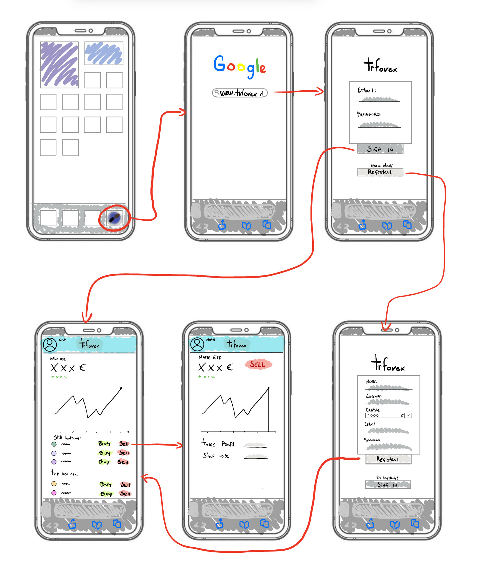

# TrForex

Impara a gestire la FOMO da trader a costo zero

## Descrizione

Con l'app **TrForex**, i giovani investitori che desiderano entrare nel mondo azionario possono creare un conto demo per aprire posizioni in Forex e comprare azioni, senza rischiare il proprio capitale. TrForex è progettata per aiutarti a sviluppare le tue competenze di trading e a gestire la paura di perdere opportunità (FOMO).
- **Target**: Piccoli investitori,
- **Problema che risolve**: Imparare ad investire in azioni

## Caratteristiche

- **Conto Demo**: Inizia a fare trading senza rischiare il tuo denaro.
- **Forex e Azioni**: Sperimenta diverse strategie di investimento in un ambiente sicuro.
- **Formazione**: Risorse educative per migliorare le tue conoscenze sul trading.
- **Gestione della FOMO**: Strumenti e consigli per aiutarti a prendere decisioni più consapevoli.

## Tecnologie
- **Api**: Utilizzo di api per la richiesta di dati di mercato.

## Competitor 

I principali competitor che offrono funzionalità identiche al mio progetto sono MetaTrader 4, MetaTrader 5, XMtrade, FXTM, OctaFX ed eToro. 
Come la mia piattaforma, consentono di creare un account demo per imparare a investire. Tuttavia, a differenza del mio progetto, 
permettono anche di aprire conti reali, supportati da istituzioni bancarie e con costi associati.

---

# Requisiti del Progetto di Trading con Conto Demo

## Requisiti di Dominio
1. **Gestione delle azioni**: Gli utenti devono poter selezionare coppie di trading (es. EUR/USD) e scegliere se acquistare o vendere.
2. **Controllo capitale**: Il sistema deve verificare che il saldo dell'utente sia sufficiente per completare un'operazione.
3. **Storico delle operazioni**: Gli utenti devono poter vedere la cronologia delle operazioni completate (acquisti e vendite).
4. **Visualizzazione grafici**: I dati delle azioni devono essere mostrati tramite grafici.

## Requisiti Funzionali
1. **Creazione di account**: Il sistema deve fornire un'interfaccia per la creazione di nuovi account utente, con la scelta del saldo iniziale.
2. **Login e gestione account**: Gli utenti devono poter accedere al proprio account e vedere il saldo attuale e le operazioni in corso.
3. **Esecuzione di ordini di acquisto e vendita**: Il sistema deve consentire agli utenti di piazzare ordini di acquisto e vendita, con la verifica del capitale.
4. **Impostazione di Take Profit e Stop Loss**: Gli utenti devono poter impostare queste soglie durante l'inserimento dell'ordine.
5. **Salvataggio dei dati su database**: Il sistema deve memorizzare tutte le informazioni dell'utente, inclusi saldo, ordini attivi, storico operazioni e impostazioni.
6. **Generazione di grafici**: Il sistema deve visualizzare grafici interattivi basati sui dati di mercato in tempo reale.

## Requisiti Non Funzionali
1. **Sicurezza**: I dati degli utenti devono essere protetti tramite crittografia, soprattutto quelli sensibili come saldo e operazioni.
2. **Performance**: Il sistema deve rispondere in tempi rapidi alle azioni degli utenti, come la verifica del saldo e l'inserimento di ordini.
3. **Usabilità**: L'interfaccia deve essere intuitiva, facilitando la gestione degli ordini e la consultazione della cronologia.

---

## Pitch del Progetto

### Sprint 1 - Implementazione delle Funzionalità Base

- **Da utente voglio poter creare un account.**  
  Tempo stimato: **5 ore**  
  Gli utenti devono poter registrarsi sulla piattaforma fornendo le loro informazioni personali e un capitale iniziale simulato.

- **Da amministratore voglio poter visualizzare il capitale dei miei utenti.**  
  Tempo stimato: **8 ore**  
  L'amministratore avrà accesso a un pannello per monitorare il capitale totale degli utenti, utile per analisi statistiche.

- **Da utente voglio poter comprare titoli azionari in modo tale da imparare a fare trading.**  
  Tempo stimato: **13 ore**  
  Questa funzionalità consente agli utenti di selezionare coppie di valute, visualizzare i loro grafici e piazzare ordini di acquisto o vendita.

### Sprint 2 - Miglioramenti e Notifiche

- **Da utente voglio poter visualizzare il mio capitale intero e vedere le operazioni aperte.**  
  Tempo stimato: **8 ore**  
  Gli utenti avranno accesso a una dashboard dove saranno visibili il saldo totale e tutte le operazioni attualmente in corso.

- **Da utente voglio poter essere notificato quando un trade aperto tocca l'average point.**  
  Tempo stimato: **8 ore**  
  Gli utenti riceveranno notifiche quando il prezzo di una valuta raggiunge un determinato valore preimpostato (average point).

## Diagramma degli Sprint

### Descrizione
Il diagramma sottostante rappresenta l'organizzazione e la priorità delle funzionalità da sviluppare in due Sprint principali. Ogni funzionalità è accompagnata da un tempo stimato per il completamento e collegata al relativo Sprint.

### Diagramma degli Sprint

---

## Wireframe dell'Applicazione

### Descrizione
Il **wireframe** rappresenta la struttura e il flusso di utilizzo dell'applicazione TrForex, con una dashboard semplice ed efficiente. Nella parte sinistra, gli utenti vedranno il loro saldo e le coppie di valute selezionate. A destra, è visibile il grafico interattivo per analizzare le fluttuazioni di mercato.

### Flusso Visivo
Il wireframe mostra il processo che un utente segue, dalla ricerca del sito su un browser alla gestione delle operazioni di trading.

### Immagine del Wireframe

---

## Esempio di richiesta API

1. un esempio di richiesta risposta API può essere la richiesta di una certa quotazione , per esempio EURUSD , e la risposta del minimo e massimo giornaliero
   in input

  	charm : "EURUSD"

   si ha in output: 

 

## Come Iniziare

1. Scarica l'app TrForex.
2. Installa i pacchetti (esegui "npm install") e avvia l'app , digitando "node server.js".
2.1. Avrai un rapito bottone per accedere nel applicazione con dati da test per controllare l'applicazione 
3. Crea il tuo conto demo registrandoti nell'apposita schermata.
4. Inizia a esplorare le opportunità di trading in Forex e azioni.

